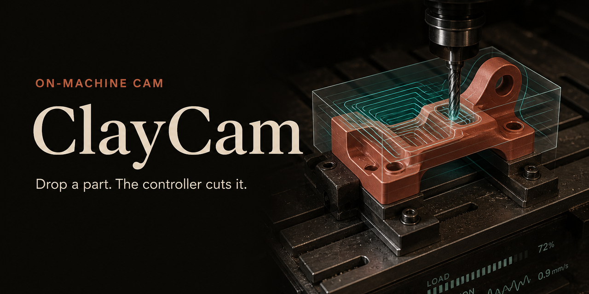
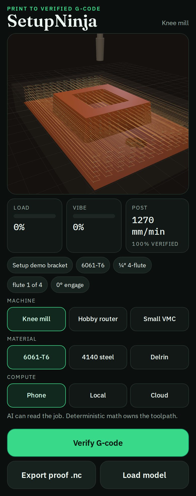
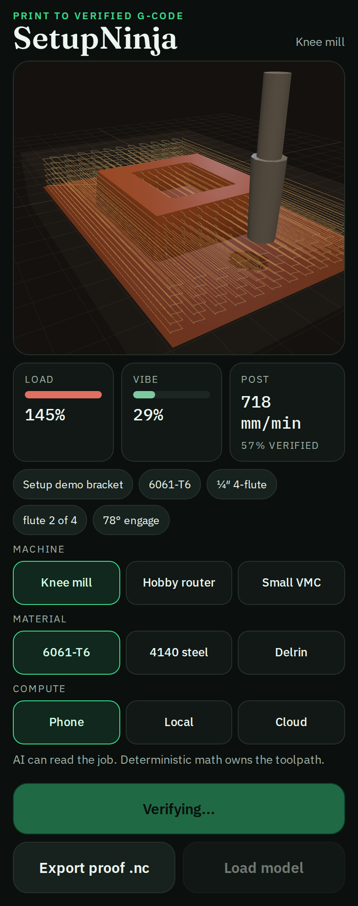

<p align="center">
  
</p>

# ClayCam

Adaptive CAM on the controller. You give it a 3D part. It reads stock, tools, and each flute as it cuts.

<p align="center">
  <a href="https://theinsidiousmachine.github.io/ClayCam/">
    
  </a>
</p>

<p align="center">
  
  
</p>

Tap **Open live demo** on your phone. Then tap **Run cut**. Drag the viewport to orbit. Pinch to zoom.

## The idea

Shop CAM still means: freeze a program at a desk, carry it to the mill, then twist feeds until the part is right.

ClayCam flips that. The controller holds the model. It knows the blank, the magazine, and the cut that is happening now. Load and vibration pull feed back. Light engagement lets it go. Home-appliance simple, like a metal 3D printer: CAD in, part out.

- **On the machine** — toolpaths live on the controller, not a USB stick
- **Per flute** — each engagement of tooth into material sets feed
- **Universal plug-in** — knee mill, hobby router, and small VMC profiles in this demo
- **Phone / local / cloud** — this kernel runs in a worker on the device you opened. Cloud is the metered shop path later
- **CAD in** — ships with the Clayton bracket, or load an STL

## Real in this repo

| Built | Next |
| --- | --- |
| Height-map CAM, raster rough + finish | Servo / GRBL / LinuxCNC I/O |
| Adaptive feed from engagement, spindle load, chatter model | Real accelerometers and current shunts |
| STL parser, three machines, 6061 / 4140 / Delrin | Probe the magazine, guess the stock |
| Phone-first controller UI | Snapdragon box, shop PC, tokened cloud |

`src/kernel` plans the job. `src/adaptive` is the sense → override loop. No placeholder modules.

## Run locally

```bash
git clone https://github.com/TheInsidiousMachine/ClayCam.git
cd ClayCam
npm install
npm test
npm run dev
```

Vite prints a LAN URL. Open that on a phone on the same Wi-Fi.

## License

[MIT](LICENSE)

<details>
<summary>GitHub Settings clicks (once, after push)</summary>

**Description:** `Adaptive CAM on the controller. Drop a part. The machine figures out the rest.`

**Homepage:** `https://theinsidiousmachine.github.io/ClayCam/`

**Topics:** `cam` `cnc` `adaptive-machining` `manufacturing` `typescript` `threejs`

**Social preview:** Settings → General → Social preview → upload [`docs/github/social-preview.png`](docs/github/social-preview.png) (1280×640).

**Pages:** Settings → Pages → Deploy from a branch → `main` / `/docs`. This repo already has the built demo in `docs/`. Private repos on GitHub Free cannot publish Pages until the repo is public or the account has Pro. The README and screenshots still work in the GitHub Android app either way.

</details>
